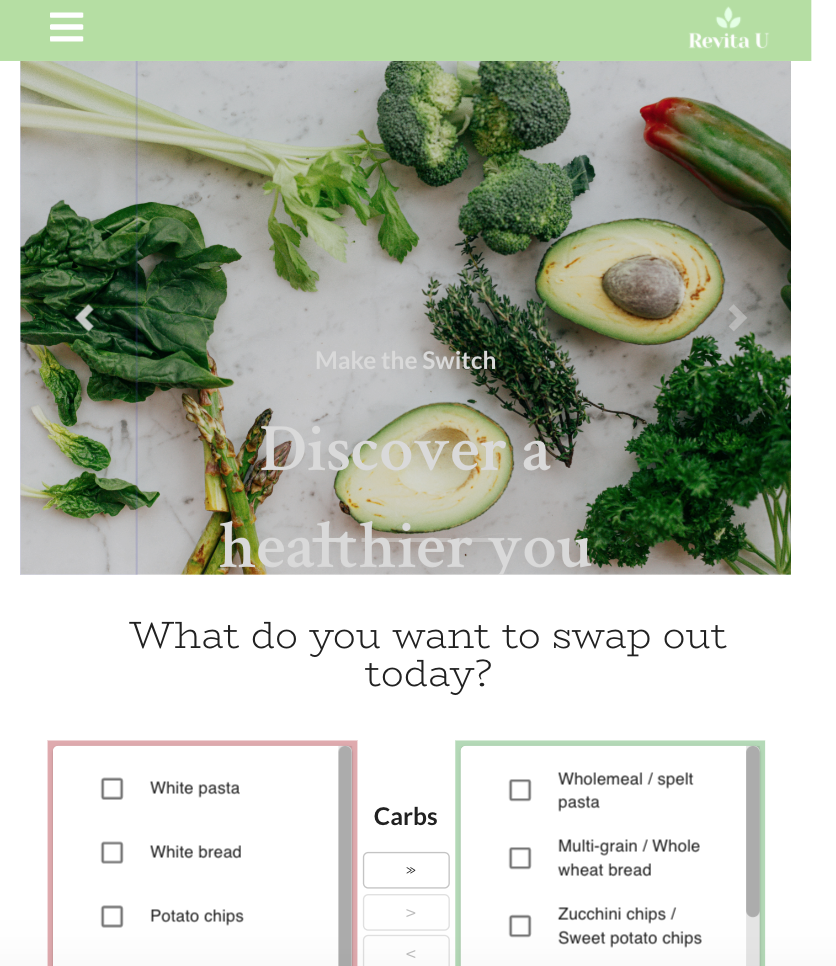

# Revita U

App: https://guarded-earth-77394.herokuapp.com/

## About this application
This application was designed with the health conscious consumer in mind, and driven in part by the increased shift towards adopting healthier eating patterns. It is mainly targeted to those who are actively trying to change their unhealthy eating habits but not sure where to start. Oftentimes, the solution to healthier eating lies in the vast array of substitutes that are available. The app serves as a journalistic tool that motivates and informs users on the range of healthier alternatives available

## Functionality 
Users can choose to swap unhealthy foods (or foods that are high in sugar, fats and carbohydrates) for healthier alternatives using the left and right boxes, where they can swap 1 or all ingredients. The app organises food into common food categories for which substitutes are available (dairy, carbs, sweets). With these healthier alternatives in mind, users can then search for recipes by ingredient, where they can save this into their library 

## User Story
AS A health conscious user looking to adopt a healthier eating regime,
WHEN I SIGN UP for an account with Revita-U,
I WANT to be presented with a list of healthier alternatives / substitutes for foods, where I can swap out
unhealthy foods for healthier substitutes,  
SO THAT I can make smarter and healthier consumption choices.
I also want to search for recipes by ingredient, which will give me nutritional information, ingredients and health labels. 
I WANT to be able to save these recipes into
my account so that I can retrieve them again when I log in.

## Technologies
Mern (Mongoose / MongoDB, Express, React/React.js, Node.js)
Passport.js
Edamam API
Semantic UI React, Material UI, Bootstrap React, Evergreen UI

## Future Directions
Adding more functionality to substitution component such as calculating nutritional information of their substituted foods. Also allowing users to log in their fitness and nutritional goals, and other health data for each day of the week. Logging in what they ate for the day or week, and calculating how much over or under they ate based on their goals or appropriate guidelines. 

## Application 

